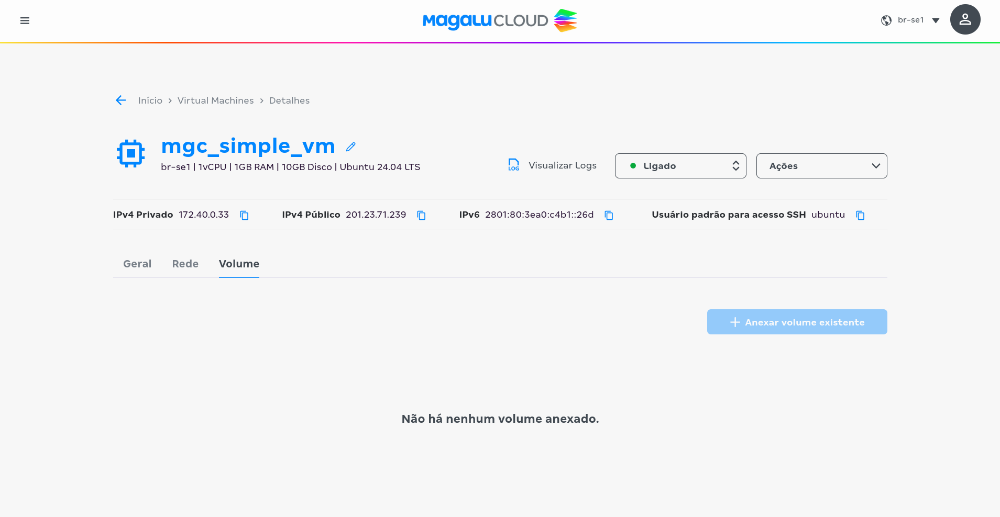

# Subindo Docker Compose na MGC



Estes scripts tem a responsabilidade de subir uma máquina virtual na MGC (Magalu Cloud) e realizar a instalação do docker compose.

Sobre a criação da máquia alguns parâmetros como a região ou o tipo da máquina podem ser alterados sem nenhum prejuízo,
basta seguir a documentação do terraform: https://registry.terraform.io/providers/MagaluCloud/mgc/latest/docs

Em relação a instalação ela é feita utilizando o Ansible, para instalar basta ter o Ansible e o Python na versão 3.12 ou maior
instalado.

## Execução do Terraform

Para subir a infraestrutura na cloud, é necessário ter as credenciais criadas,
[chave da cloud](https://docs.magalu.cloud/docs/devops-tools/terraform/how-to/auth) e [SSH](https://registry.terraform.io/providers/MagaluCloud/mgc/latest/docs/guides/ssh#1-generate-ssh-keys-on-your-local-machine),
após isso elas devem ser adicionadas à um arquivo 'terraforms.tfvars' ou via variável de ambiente, lembrando que nesse caso é preciso adicionar o TF_VAR como prefixo das variáveis.

### Exemplo de terraform.tfvars

```
mgc_api_key = "chave da api"
mgc_ssh_key = "ssh-ed25519 <RESTO DA CHAVE" 
```

### Exemplo de comandos


```shell
terraform apply
``` 

ou 

```shell
tofu apply
```
_**Obs.:** Após basta executar na pasta /infra os comandos acima é necessário fornecer a chave da mgc novamente_

## Execução do Ansible

Para realizar a instalação do Docker compose utilizando o Ansible é preciso ter a chave SSH instalada na máquina,
e criar um arquivo `inventory.yaml` e fornecer o caminho dele na execução do comando.

### Exemplo de inventory.yaml

```yaml
---
all:
  hosts:
    personal_vm:
      ansible_host: 200.0.0.0 // ip ou url da máquina
      ansible_user: ubuntu // usuário da máquina
```

### Exemplo de comandos

_Caso tenha o ansible instalado globalmente ou esteja com o environment Python ativado:_

```shell
ansible-playbook -i inventory.yml ./src/playbook.yml
```

_Caso queira rodar diretamente com Poetry sem entrar no environment:_

```shell
poetry run ansible-playbook -i inventory.yml ./src/playbook.yml
```


